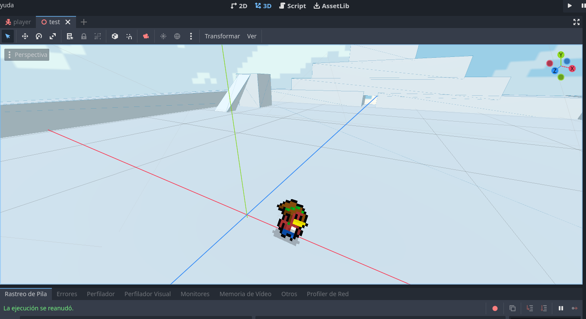
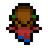
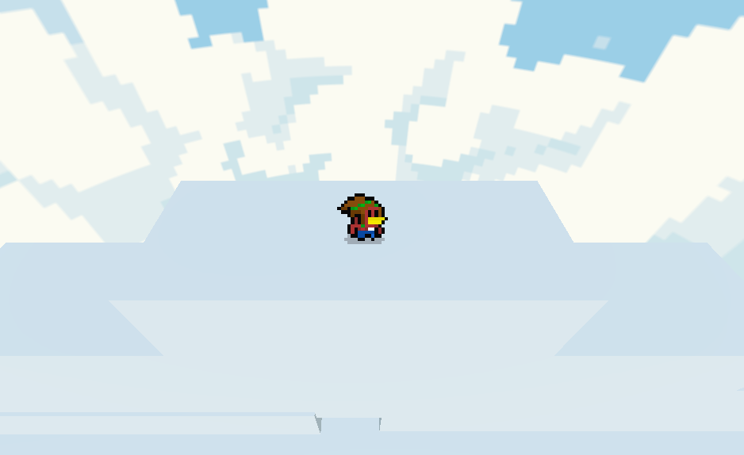

# Supay's Gates

**Supay's Gates** es el remake del juego 2D creado para el programa Endless Studios. Esta nueva versión explora un diseño 2.5D, donde los personajes en 2D pixel art interactúan con estructuras en 3D para ofrecer una experiencia más inmersiva e innovadora. Este proyecto es un reto personal que combina mi amor por el modelado 3D y el pixel art.

### Pruebas Actuales

El juego se encuentra en la fase inicial de pruebas. Actualmente, estamos evaluando el comportamiento del sprite, la cámara y los modelos 3D del entorno de prueba.

### Agregados

- 📷 **Posicionamiento de la cámara**
- 🌟 **Iluminación interactiva con el skybox**
- 🎨 **Nuevas animaciones:**
  - **Voltereta** 
  - **Caminata hacia arriba** 

### Imagen de Referencia

*Rupicola en una cima, pruebas de perspectiva*

### Más Información

El juego está en fase inicial de desarrollo. Puedes ver una versión anterior del prototipo para el programa GameLab de Endless Studios en el siguiente enlace: [Supay's Gates en Itch.io](https://gatorrante.itch.io/supai).

¡Gracias por tu interés y apoyo en el desarrollo de **Supay's Gates**!
